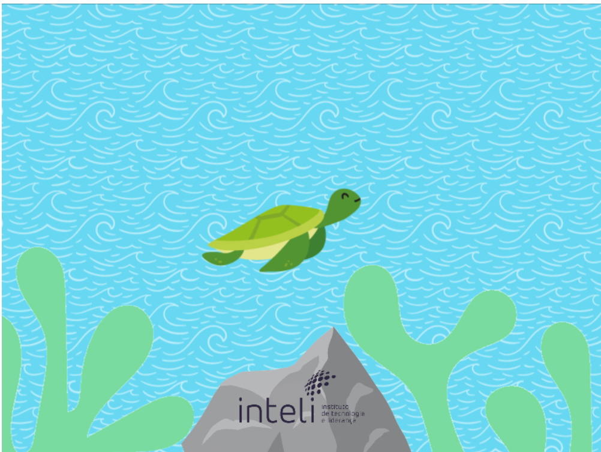

# Phaser Turtle Game

Este projeto é um pequeno jogo interativo desenvolvido com a framework **Phaser.js**, com o objetivo de treinar minhas habilidades em JavaScript. O jogo apresenta um fundo marinho com alguns elementos na tela, enquanto uma tartaruga segue o movimento do cursor do mouse.

## 🛠️ Tecnologias Utilizadas

- **JavaScript**: Linguagem de programação principal utilizada no desenvolvimento do jogo.
- **Phaser.js**: Framework para desenvolvimento de jogos em 2D, que facilita a criação de animações e interações.

## 📸 Screenshots

  

## 🚀 Funcionalidades

- **Movimento da Tartaruga**: A tartaruga se move para a posição do cursor do mouse, seguindo a movimentação do usuário.
- **Fundo Marinho**: Um fundo visual representa o ambiente marinho.
- **Elementos Gráficos**: Inclui uma pedra, algas e a logo, que enriquecem a experiência visual do jogo.

## 📝 Aprendizados

- **Fundamentos do Phaser.js**: Aprendi a configurar um projeto básico de jogo com Phaser, incluindo pré-carregamento de imagens e gerenciamento de cenas.
- **Movimentação e Interatividade**: Melhorei minhas habilidades em manipulação de objetos e eventos de entrada do usuário, como o movimento do mouse.
- **Estruturação de Jogos**: Entendi melhor como estruturar jogos em 2D utilizando cenas, sprites e atualizações em tempo real.